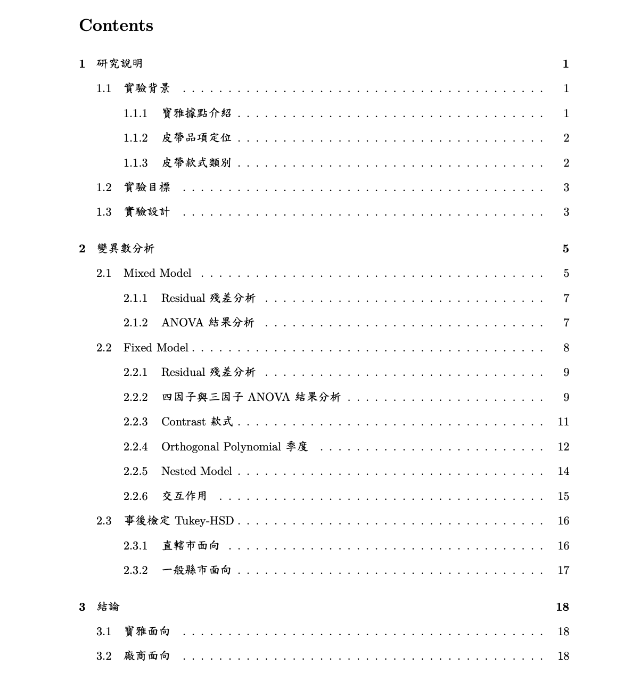

# 1131 變異數分析與實驗設計－寶雅實體店面皮帶銷售總額實驗設計之分析。（四因子實驗設計：季度、品項定位、款式、分區）

我們在這個專案中使用了以下工具：

***

在這份專案中我負責：
- 設計實驗規則與資料整理（將各項treatment與反覆數設計完善）
- 建立Mixed model 和 Fixed model。
- 設立contrast與對數執行資料做Orthogonal Polynomial
- 事後檢定
- latex與報告撰寫

***

## 實驗目標

找出不同地區及季度的產品最佳組合，並為廠商及寶雅提出銷售策略，並提升各地區的總銷售額。

## 實驗背景

我們在 2024 年一整年中進行本場實驗，以同樣廠商的「皮帶產品」，在全台每間「實體的寶
雅分店」中進行販售。
先行定義各個可被販售的皮帶產品中，每項的款式與品項定位；並在該年度中盡可能不主動
或被動下架任一產品，意即仍由廠商進行產品販售的規劃安排，如在同樣品項定位下，可進行
新增或修正不同的樣式，使其產品生命力延長，並成功持續於店鋪中販售。
由於寶雅公司的物流與管理模式緣故，所有產品非直接性寄送到各個分店進行上架，而是由
寶雅的倉儲進行管理與分發；因此，我們記錄每筆寶雅的倉儲物流（及其倉儲系統下所提供的
資料），與廠商進銷貨的狀況作為資料來源，比對各個分店的產品銷售狀況，藉此探討縣市間的
銷售總額。
鑑於寶雅在 2024 年度中，仍於台灣各地進行據點的調整，不論是新增、合併或是減少，如
新竹市於該 12 月時，開幕新分店，或寶雅將其子公司之特定店舖的「寶家」轉型回寶雅等。
然而，為了確保實驗的可靠性及其完整性，我們撇除所有寶雅營運上的問題與調整，只保留在
2024 該年度完整銷售一整年的店鋪的資料內容，其餘資料皆不採用。

## 小結

文中針對寶雅面向與廠商面向提出不同的建議，然而我們認為這項實驗耗時偏長，雖使用具有一定程度嚴謹的統計模型作為模型，但事實上應可使用其他演算法、機器學習，甚至可使用非上帝視角（頻率學派）的角度實作，
或許可以獲得更有效率的結果作為比較與參考。

